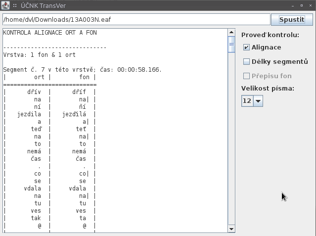

# Alignace vrstev ort a fon

*Upozornění*: detailní popis pravidel a značek, kterými se v přepisu na stopě
fon zachycuje alignace s vrstvou ort, je dostupný
[zde](https://trnka.korpus.cz/mluvka2/wiki/doku.php?id=alignace) (po přihlášení
do databáze Mluvka2), včetně vysvětlení, proč je alignace nutná, a
příkladů. Pokud s alignací ještě nejste obeznámeni, přečtěte si nejprve prosím
výše uvedený dokument.

Tento návod popisuje, jak využít informace o chybách v alignaci vrstev ort a
fon, které vám TransVer poskytuje. Předpokládá, že už jste program úspěšně
spustili a výsledky kontroly máte k dispozici; pokud ne a nevíte si s ovládáním
rady, podívejte se na [oddíl o ovládání programu v úvodu](./intro.md#ovladani).

Po provedení kontroly alignace by měl TransVer dodat výstup v následující
podobě:

Každý segment, v němž si počet slov na vrstvách ort a fon neodpovídá, je
shrnut v tabulce, která obsahuje v prvním sloupci slova na vrstvě ort a v
druhém sloupci slova na vrstvě fon. Připomínáme, že mezi dvěma slovy na vrstvě
fon může být kromě mezery (jako na vrstvě ort) i svislítko `|`, které značí, že
obě slova foneticky splývají do jednoho přízvukového taktu.

Mějme např. následující chybovou tabulku:

    Segment č. 36 v této vrstvě; čas: 00:05:16.120.
    |        ort |        fon |
    ===========================
    |      [no]  |      [nó]  |
    |         .  |         .  |
    |       teď  |       teť| |
    |        se  |        se  |
    | například  | napříklat  |
    |   strašně  |   strašňe  |
    |      těší  |      ťeší  |
    |        že  |   žebudou  |
    |     budou  |       mít  |
    |       mít  |    jehňata |
    |    jehňata |            |

Z ní je patrné, že až do slova "těší" je vše v pořádku (slova na obou vrstvách
si odpovídají). Pak ale máme na vrstvě ort pouhé "že", kdežto na vrstvě fon je
přepis "žebudou". To jsou jasně slova dvě (pouze foneticky splývají v jeden
takt), jen se při přepisu zapomnělo na doplnění svislítka, které tento fakt
zachytí způsobem srozumitelným i pro počítač. Stačí tedy otevřít přepis v
programu ELAN a do příslušného segmentu na stopě fon doplnit mezi "že" a
"budou" svislítko: `že|budou`.

Ideální je v tuto chvíli **soubor .eaf v ELANu uložit a znovu spustit kontrolu
v TransVeru**: právě opravená chyba se již nezobrazí a můžete pokračovat těmi
zbývajícími. Toto se vyplatí zejména v případě, pokud máte vícero chyb v jednom
segmentu, protože když nastane větší posun mezi vrstvou ort a fon, nemusí být
úplně lehké vyčíst z tabulky způsob, jak problémy ke konci segmentu
napravit. Ale pokud je chyb málo, stačí pochopitelně spustit kontrolu jen
jednou a opravit je všechny naráz.

Povšimněte si též, že před každou tabulkou jsou uvedeny dvě informace, podle
nichž lze segment v programu ELAN jednoduše najít. Jedná se o:

1. **Číslo** segmentu **v rámci dané vrstvy**, podle něhož lze segment v ELANu
   identifikovat v **Transcription Mode** (viz níže popis způsobu, jak si v
   Transcription Mode zobrazit jen jednu vrstvu).
2. **Čas začátku** segmentu, který se hodí při hledání segmentu v **Annotation
   Mode**.

Pokud chcete, aby čísla segmentů uváděná TransVerem odpovídala číslům
zobrazovaným v Transcription Mode v ELANu, musíte si ELAN nastavit tak, aby
zobrazoval pouze relevantní vrstvu. To učiníte tak, že v Transcription Mode v
rámečku `Settings` po levé straně kliknete na tlačítko `Configure...`. Vyskočí
dialog, v němž klikněte na tlačítko `Select tiers...`, a mezi nabízenými
vrstvami si vyberte pouze tu, kterou zrovna opravujete.

Na závěr -- po opravení všech nahlášených chyb -- pro jistotu spusťte TransVer
ještě naposledy jednou, abyste se ujistili, že vám žádná nesrovnalost v
alignaci opravdu neunikla. Alignaci totiž zaznamenáváme kvůli dalšímu
počítačovému zpracování přepisů a má smysl pouze v případě, že je bezchybná.

# Další typy chyb a jejich řešení -- příklady

## Přebytečné svislítko

Občas se může stát, že svislítko omylem vložíte hned vedle mezery¹,
např. původní ortografický přepis "[ne] no [až]" převedete na fonetickou
transkripci "[ne] no| [aš]". Takovéto přebytečné svislítko se projeví prázdným
řádkem v chybové hlášce:

    |   ort |   fon |
    =================
    | [ne]  | [ne]  |
    |   no  |   no| |
    |  [až] |       |
    |       |  [aš] |

V takovém případě stačí zbloudilé svislítko umazat a chyba zmizí.

<!-- Významem takto umístěného svislítka je, že na ortu je zapsané slovo, které na -->
<!-- fonu nemá samostatnou fonetickou realizaci (např. "v podstatě" může být -->
<!-- vysloveno jako "|poctaťe" -- předložku "v" neslyšíme, ale víme, že ji mluvčí -->
<!-- zamýšlel -->

¹ V některých případech se svislítko takto umisťuje cíleně, více viz bod 2
[zde](https://trnka.korpus.cz/mluvka2/wiki/doku.php?id=alignace#nektere_slozite_pripady_a_jejich_reseni).
